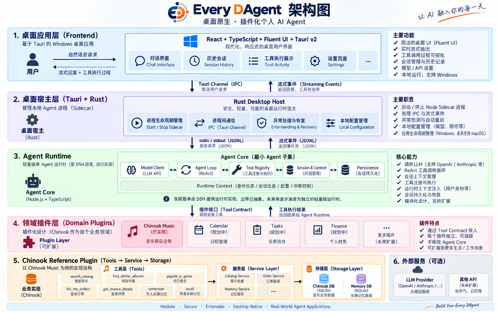

<div align="center">


# Every DAgent

### One Runtime. Many Plugins. An Agent for Everyday Life.

**A desktop-native personal AI agent built around a modular runtime,  
tool calling, persistent context and plugin-based domain architecture.**

React · TypeScript · Tauri · Rust · ReAct · Tool Calling · SQLite

[简体中文](./README.zh-CN.md)

</div>

---

## Overview

**Every DAgent** is an extensible desktop AI agent designed around a simple idea:

> Keep the Agent Runtime small, and grow real-world capabilities through independent domain plugins.

Instead of coupling the model, UI and business logic together, Every DAgent separates the system into clear layers:

- **Desktop Application** — native user experience built with React, Fluent UI and Tauri
- **Agent Runtime** — model interaction, agent loop, tools, sessions, context and persistence
- **Domain Plugins** — isolated capabilities such as music, calendar, tasks and personal finance
- **Tools & Services** — explicit interfaces between the agent and real data
- **Local Storage** — persistent sessions, memories and domain data

The current reference implementation ships with **Chinook Music**, a complete music-store domain covering catalog search, recommendations, order lookup and long-term memory.

The long-term goal is not to build a music chatbot.

It is to build a **small but complete personal Agent architecture that can continuously absorb new capabilities without rewriting the core system.**

---

## Demo

> Every DAgent currently ships as a Windows desktop application.

<!-- Replace with the best full-window screenshot -->

<p align="center">
  
</p>


The desktop experience includes:

- streaming assistant responses
- visible tool execution
- persistent conversation history
- agent activity tracing
- model endpoint configuration
- automatic sidecar recovery
- local long-term memory

---

## Engineering Highlights

### Modular Agent Architecture

Every DAgent separates the Agent system into five core responsibilities:

```text
Model Client
     ↕
Agent Loop
     ↕
Tool Registry
     ↕
Session & Context
     ↕
Persistence
```

This boundary keeps model interaction, tool execution, conversation state and storage independent from domain-specific business logic.

### ReAct-style Tool Execution

The Agent can iteratively move between model reasoning and tool execution:

```text
User Request
      ↓
Context Assembly
      ↓
     LLM
      ↓
  Tool Call?
   ↙     ↘
 Yes      No
  ↓        ↓
Execute   Answer
  ↓
Tool Result
  ↓
     LLM
```

Tools are not embedded directly into the desktop UI or model client.

They are registered through the Agent / Domain boundary and invoked through explicit contracts.

### Plugin-based Domain Layer

Business capabilities live outside the Agent core.

```text
Every DAgent
│
├── Agent Runtime
│
└── Domain Plugins
     │
     ├── Chinook Music        ✓ implemented
     ├── Calendar             planned
     ├── Tasks                planned
     ├── Personal Finance     planned
     └── ...
```

A domain plugin owns its own tools, services, business rules, storage access and domain-specific memory behavior.

The desktop host does not need to know how a music recommendation or invoice query works.

The Agent Runtime does not need to know how the underlying database is structured.

### Desktop-native Agent Runtime

Every DAgent is not a browser wrapper around an API.

The application uses a multi-process desktop architecture:

```text
React + Fluent UI
        ↓
Tauri IPC / Channel
        ↓
Rust Desktop Host
        ↓
stdin / stdout JSONL
        ↓
Node Agent Process
        ↓
Agent Runtime
        ↓
Domain Plugin
```

The Rust host owns the application lifecycle and manages the long-running Agent sidecar process.

The Node process owns the Agent execution environment.

They communicate through a small JSONL protocol instead of HTTP or WebSocket.

### Persistent Sessions & Memory

Conversations are durable Agent sessions rather than temporary chat messages.

The current implementation supports persistent session history, session restoration, customer-scoped long-term memory, runtime identity propagation and local SQLite persistence.

Domain data and memory remain scoped to the active user identity.

### Observable Tool Execution

Agent execution is exposed to the user instead of being hidden behind a loading indicator.

The desktop UI can visualize events such as:

```text
turn/start
model/start
tool/call
tool/result
assistant/chunk
turn/end
turn/error
```

This makes an Agent run inspectable from request to final response.

### Runtime Recovery

The desktop host supervises the Node Agent process.

If the sidecar exits unexpectedly, the application can detect the failure, restart the Agent process, restore the previous session, rehydrate the desktop state and continue accepting requests.

This keeps lifecycle concerns inside the desktop host rather than leaking them into business plugins.

---

# Architecture

<p align="center">
  
</p>


The system is organized into six layers:

| Layer                 | Responsibility                                               |
| --------------------- | ------------------------------------------------------------ |
| **Desktop App**       | Chat UI, session history, tool activity and settings         |
| **Desktop Host**      | Native lifecycle, IPC, sidecar management and recovery       |
| **Agent Runtime**     | Model interaction, Agent Loop, tools, context and persistence |
| **Domain Plugins**    | Independent real-world capability modules                    |
| **Domain Services**   | Business logic and storage abstraction                       |
| **External Services** | LLM providers and future third-party APIs                    |

The key design rule is simple:

> **Agent orchestration stays inside the Runtime. Business behavior stays inside plugins.**

---

# How One Agent Turn Works

A complete request travels through the system like this:

```text
User
 │
 ▼
React Chat UI
 │
 ▼
Tauri Command
 │
 ▼
Rust Desktop Host
 │
 ▼
JSONL IPC
 │
 ▼
Agent Process
 │
 ▼
Session & Context
 │
 ▼
LLM
 │
 ├──────────── no tool ────────────┐
 │                                  │
 ▼                                  │
Tool Call                            │
 │                                  │
 ▼                                  │
Tool Registry                        │
 │                                  │
 ▼                                  │
Domain Plugin                        │
 │                                  │
 ▼                                  │
Service Layer                        │
 │                                  │
 ▼                                  │
SQLite / External Data               │
 │                                  │
 ▼                                  │
Tool Result                          │
 │                                  │
 └──────────────► LLM ◄─────────────┘
                    │
                    ▼
             Streaming Events
                    │
                    ▼
              Desktop UI
```

The frontend never queries the business database directly and never calls the model directly.

---

# Reference Domain — Chinook Music

Chinook Music is the first complete domain implementation used to validate the architecture end to end.

It is intentionally treated as a **reference plugin**, rather than the identity of the whole project.

### Available Tools

| Tool                  | Capability                                   |
| --------------------- | -------------------------------------------- |
| `search_catalog`      | Search artists, albums and tracks            |
| `find_similar_albums` | Find related albums                          |
| `popular_in_genre`    | Explore popular music within a genre         |
| `list_my_orders`      | Query the active customer's purchase history |
| `get_invoice_details` | Inspect an owned invoice and its line items  |
| `remember`            | Write customer-scoped long-term memory       |
| `recall`              | Retrieve customer-scoped memory              |

These tools demonstrate retrieval, user-scoped business actions and long-term memory.

---

# Agent Runtime

The Agent Runtime is the architectural center of Every DAgent.

Its responsibilities are intentionally kept small:

```text
Agent Runtime
│
├── Model Client
│     └── LLM request / response abstraction
│
├── Agent Loop
│     └── model → tool → observation → model
│
├── Tool Registry
│     └── registration and dispatch
│
├── Session & Context
│     └── conversation lifecycle and runtime context
│
└── Persistence
      └── durable session and state storage
```

The domain layer is intentionally excluded from this core.

This makes the runtime reusable across different personal-data domains.

### Current Runtime

The current stable implementation uses **DeepSeek Harness (DSH)** behind this runtime boundary for model execution, sessions and tool dispatch.

The surrounding architecture — desktop host, JSONL transport, domain boundary, business services, storage model and UI event projection — is kept independent from that implementation.

### Runtime Direction

The Runtime boundary is being reduced toward a lightweight standalone implementation built around:

```text
Model Client
Agent Loop
Tool Registry
Session Context
Persistence
```

The goal is not to build another large Agent framework.

The goal is to keep the minimum abstractions required to run a reliable single-Agent application.

---

# Desktop Architecture

## Frontend

```text
React
TypeScript
Fluent UI
Vite
```

The frontend is a presentation layer.

It owns conversation rendering, session navigation, Agent activity visualization, model settings and desktop interaction.

It does **not** own business logic.

## Rust Desktop Host

Built with **Tauri v2**, the Rust host manages application lifecycle, Agent sidecar lifecycle, IPC, process monitoring, recovery, local configuration and Windows packaging.

The application is currently Windows-first while keeping the desktop boundary compatible with future platform expansion.

## Agent Bridge

The desktop host communicates with the Node Agent process through:

```text
stdin  → JSONL requests
stdout ← JSONL events
```

The bridge remains deliberately thin.

It is transport, not business logic.

---

# Tool & Plugin Contract

Every domain exposes capabilities through tools instead of exposing raw storage primitives directly to the LLM.

For example:

```text
get_invoice_details(invoice_id)
```

is preferred over giving the model unrestricted SQL access.

This allows the domain layer to enforce ownership checks, identity boundaries, parameter validation, stable business semantics and controlled data access.

The model decides **which capability to use**.

The plugin decides **how that capability is safely implemented**.

---

# Tech Stack

| Area                 | Technology                           |
| -------------------- | ------------------------------------ |
| Desktop UI           | React 18 + TypeScript + Fluent UI v9 |
| Build                | Vite                                 |
| Native Host          | Tauri v2 + Rust                      |
| Agent Process        | Node.js + TypeScript                 |
| Runtime Transport    | stdin / stdout JSONL                 |
| Agent Runtime        | DSH-backed runtime boundary          |
| Business Layer       | TypeScript Domain Plugins            |
| Database             | SQLite / `better-sqlite3`            |
| Testing              | Vitest + Cargo Test                  |
| Package Management   | pnpm workspace                       |
| Windows Distribution | NSIS / MSI                           |

---

# Project Structure

```text
every-dagent/
│
├── apps/
│   ├── desktop/
│   │   ├── React frontend
│   │   └── Tauri / Rust host
│   │
│   ├── agent-bridge/
│   │   └── Desktop ↔ Agent JSONL transport
│   │
│   └── cli/
│       └── CLI Agent entry
│
├── plugins/
│   └── chinook/
│       ├── tools/
│       ├── services/
│       └── memory/
│
├── profiles/
│   └── chinook/
│
├── tests/
├── docs/
└── assets/
    ├── screenshots/
    └── architecture/
```

---

# Reliability & Testing

The project contains automated tests across both the Agent and desktop boundaries.

Current coverage includes domain services, tools, long-term memory, Agent bridge, configuration, model listing, Agent end-to-end flow, desktop reducers and architecture invariants.

```bash
pnpm test
```

The current TypeScript test suite contains:

```text
15 suites
207 tests
```

The Rust desktop host has an independent Cargo test suite:

```bash
cd apps/desktop/src-tauri
cargo test
```

---

# Getting Started

## Requirements

- Windows 10 / 11
- Node.js >= 22
- pnpm
- Rust stable + MSVC toolchain for desktop development
- WebView2

## Install

```bash
pnpm install
```

## Bootstrap Local Data

```bash
pnpm bootstrap
```

This initializes the local Chinook domain and memory storage.

## Start the CLI Agent

```bash
pnpm chinook-agent
```

## Start the Desktop App

```bash
pnpm desktop
```

## Model Configuration

The desktop application provides an in-app model settings page.

You can configure:

- Base URL
- API Key
- Model

The current implementation supports OpenAI-compatible model endpoints.

Credentials are stored locally and are not committed to the repository.

---

# Design Principles

### 1. Keep the Agent Core Small

Only generic Agent responsibilities belong in the Runtime.

Domain knowledge stays outside.

### 2. Tools Are Capability Boundaries

The model receives meaningful domain operations, not unrestricted database access.

### 3. Context Follows Execution

Identity, session and configuration travel with the Agent execution context.

### 4. Plugins Own Business Rules

The Runtime orchestrates.

Plugins decide what domain operations actually mean.

### 5. Desktop Is a Host, Not the Agent

React and Rust manage user interaction and lifecycle.

They do not contain Agent business logic.

### 6. Prefer Explicit Data Flow

Tool calls, results and Agent events are observable instead of hidden behind abstractions.

---

# Roadmap

### Agent Runtime

- [x] Persistent Agent sessions
- [x] Tool calling
- [x] Runtime context
- [x] Local persistence
- [x] Streaming execution events
- [ ] Lightweight standalone Agent Loop
- [ ] Independent Model Client abstraction
- [ ] Standalone Tool Registry
- [ ] Runtime-level execution budgets and termination policies

### Domain Plugins

- [x] Chinook Music
- [ ] Calendar
- [ ] Tasks
- [ ] Personal Finance
- [ ] Additional user-authorized domains

### Desktop

- [x] Windows desktop application
- [x] Streaming chat
- [x] Tool activity visualization
- [x] Session history
- [x] Model settings
- [x] Sidecar recovery
- [ ] macOS support

---

# Why Every DAgent?

Many Agent demos start from a framework and end at a chatbot.

Every DAgent explores the opposite direction:

```text
Real Application
      ↓
Explicit Architecture
      ↓
Small Agent Runtime
      ↓
Composable Domain Plugins
```

The project is primarily an exploration of **how to turn an LLM Agent into a maintainable desktop application**:

- Where should the Agent Loop live?
- What belongs in Context?
- What should be a Tool?
- Where should identity be enforced?
- How should the desktop host communicate with the Agent?
- How can new domains be added without rebuilding the entire system?
- How small can the Runtime remain before it stops being useful?

Every DAgent is the working answer to those questions.

---

# Current Limitations

Every DAgent is currently an engineering project and reference implementation, not a production multi-user platform.

Current boundaries include:

- Windows-first desktop support
- local single-user execution
- demo identity rather than production authentication
- local SQLite persistence
- Chinook as the only complete domain plugin
- live model credentials required
- unsigned Windows installers

These constraints are intentional: the project focuses on Agent architecture rather than production SaaS infrastructure.

---

# Inspirations

Every DAgent was built while studying and experimenting with several Agent systems and examples:

- **DeepSeek Harness** — Agent runtime and plugin architecture
- **pi** — lightweight Agent / coding-agent design
- **LangChain Chinook example** — the original music-domain Agent example

The project gradually moves from framework-backed implementation toward a smaller, independently controlled Agent Runtime.

---

<div align="center">


## Every DAgent

**One Runtime. Many Plugins. An Agent for Everyday Life.**

Built to understand how real Agent applications should be structured —  
not just how to call an LLM.

</div>
